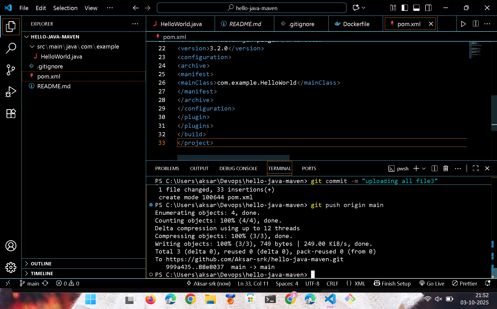
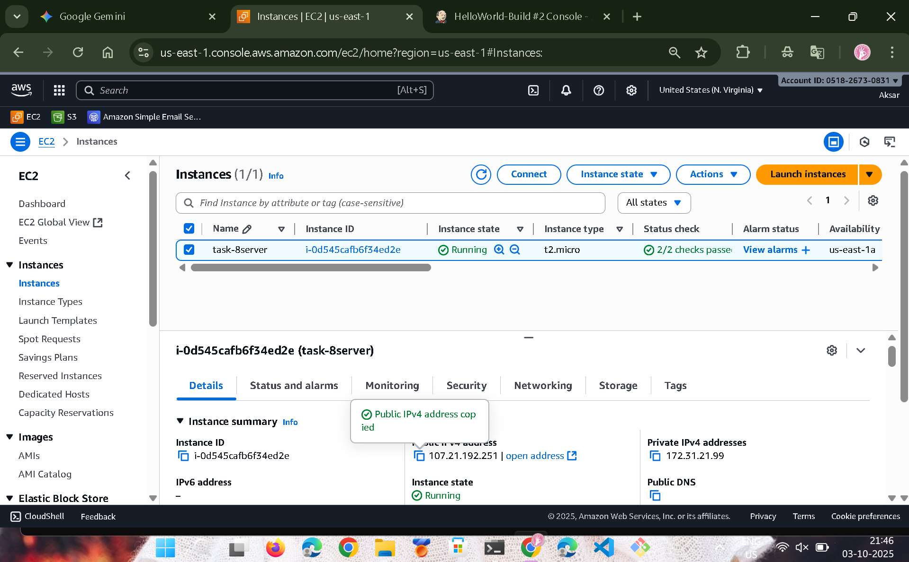
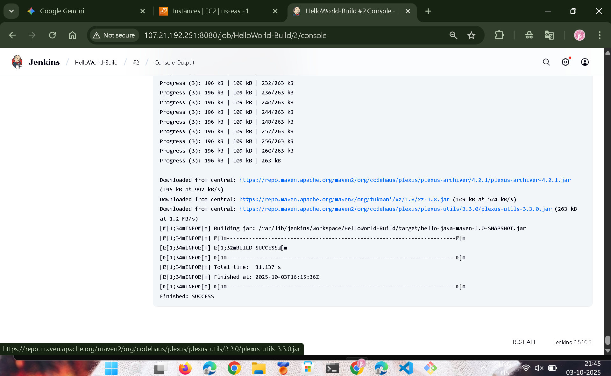
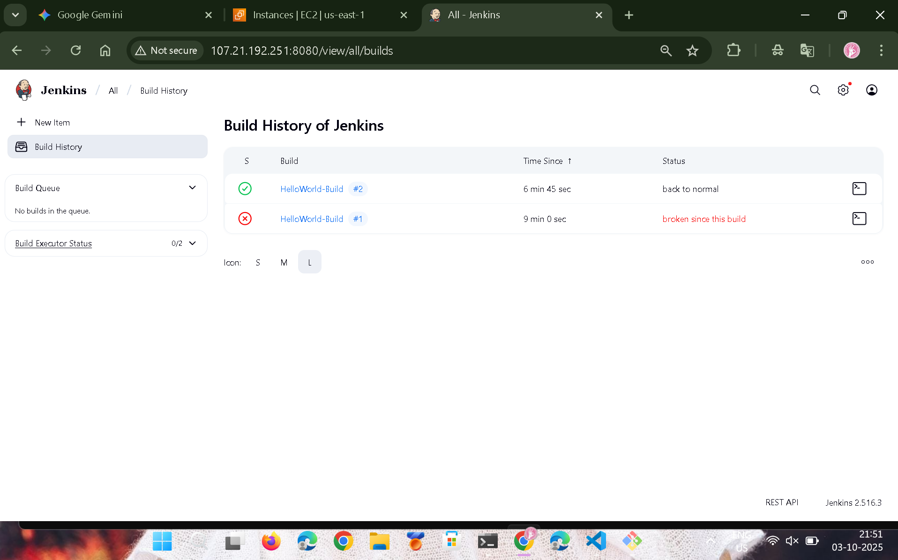
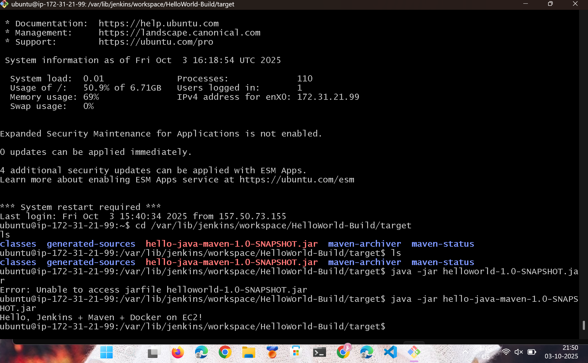

# HelloWorld Java Maven App with Jenkins on EC2

This project demonstrates building and deploying a simple Java **HelloWorld** Maven application on an **Ubuntu EC2 instance** using **Jenkins**.  

It covers:

- Installing Java, Maven, Jenkins on EC2
- Configuring Jenkins with JDK and Maven
- Creating a Jenkins Freestyle job to build the Maven project
- Running the application JAR on EC2 automatically after each build

---

## **Project Structure**
```HelloWorldProject/
├── pom.xml
└── src/
   └── main/
      └── java/
        └── com/
          └── example/
             └── HelloWorld.java
```




## EC2 Setup
- Launch Ubuntu EC2
- Security Group Inbound Rules:
  SSH → 22 → Your IP
  HTTP → 80 → Optional
  Jenkins → 8080 → Anywhere (0.0.0.0/0)
  
## Connect via SSH
- Update Ubuntu & Install Java and Maven
 ```bash
sudo apt update -y
sudo apt upgrade -y
sudo apt install openjdk-11-jdk maven wget gnupg -y

# Verify installations
java -version
javac -version
mvn -version
```
- Jenkins Installation on Ubuntu EC2
 -These commands install the prerequisites (Java) and Jenkins from its official stable Debian repository, including  the critical GPG key setup.
- Prerequisites: Install Java (OpenJDK 17)
-Jenkins requires Java to run. OpenJDK 17 is a supported version.
```bash
# 1. Update the local package index
sudo apt update

# 2. Install OpenJDK 17 and fontconfig
sudo apt install fontconfig openjdk-17-jre -y
```
- Jenkins Repository and Installation
- The following steps add the necessary GPG key and the repository URL to successfully install the Jenkins package.
```bash
# 3. Add the Jenkins GPG key for package verification
# This resolves the "NO_PUBKEY" error.
curl -fsSL [https://pkg.jenkins.io/debian-stable/jenkins.io-2023.key](https://pkg.jenkins.io/debian-stable/jenkins.io-2023.key) | sudo tee /usr/share/keyrings/jenkins-keyring.asc > /dev/null

# 4. Add the Jenkins stable repository to the system's sources list
echo deb [signed-by=/usr/share/keyrings/jenkins-keyring.asc] \
  [https://pkg.jenkins.io/debian-stable](https://pkg.jenkins.io/debian-stable) binary/ | sudo tee /etc/apt/sources.list.d/jenkins.list > /dev/null

# 5. Update the package index again to recognize the new Jenkins repository
sudo apt update

# 6. Install Jenkins
sudo apt install jenkins -y
```
- Service Management
- Verify the installation and ensure Jenkins starts automatically.
```bash
# 7. Enable Jenkins to start automatically on boot
sudo systemctl enable jenkins

# 8. Start the Jenkins service
sudo systemctl start jenkins

# 9. Check the status (should show 'active (running)')
sudo systemctl status jenkins
```
- Accessing Jenkins
- After installation, access Jenkins via your browser: http://<Your-EC2-Public-IP>:8080
- To unlock Jenkins, retrieve the initial administrative password:
```bash
# 10. Retrieve the initial admin password from the server
sudo cat /var/lib/jenkins/secrets/initialAdminPassword
```

## 1. Global Tool Configuration (Manage Jenkins)

These settings tell Jenkins where to find the necessary tools (JDK and Maven) for building Java projects.

### JDK Configuration

The JDK is pre-installed on the Jenkins host (e.g., the EC2 instance) and configured manually.

| Setting | Value | Notes |
| :--- | :--- | :--- |
| **Name** | `JDK11` | User-friendly name for the tool. |
| **Install automatically** | **Unchecked** | We are using a manually installed JDK location. |
| **JAVA\_HOME** | `/usr/lib/jvm/java-11-openjdk-amd64` | The exact path where OpenJDK 11 is installed on the server. |

### Maven Configuration

Maven will be managed and downloaded automatically by Jenkins.

| Setting | Value | Notes |
| :--- | :--- | :--- |
| **Name** | `Maven3` | User-friendly name for the Maven tool. |
| **Install automatically** | **Checked** | Jenkins will handle the download and installation of the latest stable version. |

---

## Jenkins Freestyle Job Configuration

This section details the setup for the `HelloWorld-Build` job, which pulls the source code and executes the Maven build.

### Job Creation and Setup

| Field/Section | Action | Value |
| :--- | :--- | :--- |
| **New Item** | Select **Freestyle project** | |
| **Name** | `HelloWorld-Build` | The name of your Jenkins job. |

### Source Code Management (SCM)

This configures Jenkins to pull the code from the Git repository.

| Configuration | Value |
| :--- | :--- |
| **SCM Type** | **Git** |
| **Repository URL** | `https://github.com/Aksar-srk/hello-java-maven.git` |
| **Branch Specifier** | `*/main` | Specifies the branch to build. |

### Build Step: Invoke Top-Level Maven Targets

This is the core CI step where Maven compiles and packages the application.

| Configuration | Value |
| :--- | :--- |
| **Build Step Type** | **Invoke top-level Maven targets** |
| **Maven Version** | `Maven3` | (Select the Maven tool name configured in Section 1) |
| **Goals** | `clean package` | Compiles the code and creates the `.jar` file. |



- Running the Application Manually
```bash
cd /var/lib/jenkins/workspace/HelloWorld-Build/target
java -jar hello-java-maven-1.0-SNAPSHOT.jar
```
|Output:|
|Hello, World from Maven build!|

